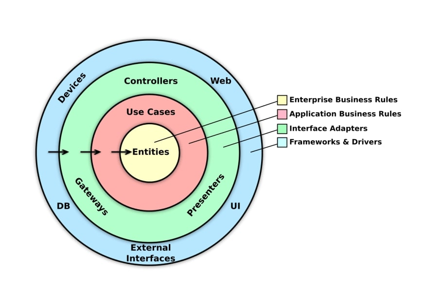

# Eventify API

An Event Platform API built with ASP.NET Core, EF Core, PostgreSQL, Amazon S3, Amazon Cognito, Clean Architecture, DDD,
CQRS and other technologies.

👉 This project was developed for educational purposes, but feel free to use it as a reference or for any other purpose.

## :memo: Requirements

To successfully build and run this project, you will need the following tools properly configured:

- [ASP.NET Core 8](https://dotnet.microsoft.com/en-us/download/dotnet/8.0)
- [EF Core CLI Tools](https://learn.microsoft.com/en-us/ef/core/cli/dotnet)
- [Docker](https://www.docker.com/)
- [Amazon S3](https://aws.amazon.com/s3/)
- [Amazon Cognito](https://aws.amazon.com/cognito/)

:information_source: In the `/aws` directory, you will find the `cognito-functions` sln with a Lambda Function implementation to handle the 
AWS Cognito [Pre Sign-Up](https://docs.aws.amazon.com/cognito/latest/developerguide/user-pool-lambda-pre-sign-up.html#user-pool-lambda-pre-sign-up-flows) event.
This Lambda Function is used to automatically confirm the user during registration. Build and deploy this Lambda function to AWS and configure Cognito to trigger it.
Otherwise, manual user confirmation will be required. Also, create the user groups `attendee` and `producer` to manage user roles in the system.

## :sparkles: Project

### :bulb: Overview

Eventify is a simple event platform where producers can create and manage events, and attendees can search for events and book tickets.

### :triangular_ruler: Architecture

The project follows the Clean Architecture principles inspired by [Jason Taylor's Clean Architecture Solution Template](https://github.com/jasontaylordev/CleanArchitecture),
with some modifications to suit my preferences and needs.



## :runner: Getting Started

1. Clone the repository

```shell
git clone https://github.com/pedrior/eventify-api.git
cd eventify-api
```

2. Configure the required application settings

```json
{
  "ConnectionStrings": {
    "DefaultConnection": "Your PostgreSQL connection string (Skip if you're using Docker Compose)"
  },
  "AWS": {
    "Region": "Your AWS Region",
    "UserPoolClientId": "Your AWS Cognito User Pool Client Id",
    "UserPoolClientSecret": "Your AWS Cognito User Pool Client Secret",
    "UserPoolId": "Your AWS Cognito User Pool Id"
  },
  "Storage": {
    "Bucket": "Your S3 Bucket Name"
  }
}
```

> :warning: Make sure you have configured the AWS credentials in the environment variables.
> See [Environment variables to configure the AWS CL](https://docs.aws.amazon.com/cli/latest/userguide/cli-configure-envvars.html) for further details.

3. Create a certificate for the API to run on Docker over HTTPS

```shell
dotnet dev-certs https -ep $env:USERPROFILE\.aspnet\https\Eventify.Presentation.pfx -p password
dotnet dev-certs https --trust
```

> :warning: Make sure that the certificate name and password match those specified in the `docker-compose.yml` file.
> See [Developing ASP.NET Core Applications with Docker over HTTPS](https://github.com/dotnet/dotnet-docker/blob/main/samples/run-aspnetcore-https-development.md) for further details.

4. Create and apply the database migration
   
> :information_source: In this step, you need to have the database running for the migration to be successful.

```shell
dotnet ef migrations add Initial -s src/Eventify.Presentation -p src/Eventify.Infrastructure -o ./Common/Persistence/Migrations
dotnet ef database update -s src/Eventify.Presentation -p src/Eventify.Infrastructure
```

5. Run with Docker Compose

```shell
docker compose up --build
```

## :page_with_curl: License

This project is licensed under the terms of the [MIT](https://github.com/pedrior/eventify-api/blob/master/LICENSE)
license.
